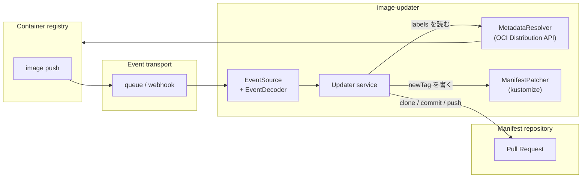

# image-updater

コンテナレジストリへの image push を受けて、GitOps リポジトリの `kustomization.yaml` の
イメージタグを更新する PR を自動で作るアプリケーション。

## Why

[argocd-image-updater](https://github.com/argoproj-labs/argocd-image-updater) には
[レジストリのタグ解決に関する問題](https://github.com/argoproj-labs/argocd-image-updater/issues/657)
があり、回避が難しかった。タグの一覧をポーリングして「最新」を推測するのではなく、
**レジストリが送る push イベントをそのまま信じる**方式にしたのがこのアプリケーション。

- ポーリングしないので、push から PR までのラグがない
- 「どのイメージが push されたか」はイベントに書いてあるので、タグの推測が要らない
- 更新は PR になるので、レビューと revert が普通の git 操作でできる

## What

1. レジストリの push イベントを受け取る
2. 設定ファイルのルールと突き合わせて、更新対象の manifest ディレクトリを決める
3. イメージに焼かれた OCI label を読んで PR の説明を組み立てる
4. manifest リポジトリを clone してタグを書き換え、PR を作る



### 処理フロー

1. **イベント受信**: レジストリの push イベントを受け取り、レジストリ非依存の
   `ImagePushEvent` に変換する
2. **ルールマッチング**: イベントのレジストリホスト・リポジトリパス・タグを設定ファイルの
   ルールと照合し、更新対象の manifest の場所を決める
3. **メタデータ取得**: OCI Distribution API でイメージの label とサイズを読む。
   ここで失敗しても更新自体は続行する（[opt-in](#label-による注釈)）
4. **リポジトリ clone**: manifest リポジトリを clone してブランチを切る
5. **manifest 更新**: 対象イメージの `newTag` を書き換える。label による注釈が有効なら、
   `images:` の直上に [well-known image manifest](./docs/image-manifest.md) の
   メタデータコメントも書き込む
6. **commit & push**: 変更を commit して、そのブランチだけを push する
7. **PR 作成**: PR を作る。label から取れれば、イメージをビルドしたユーザーを
   assignee と reviewer に設定する

### 対応状況

| 関心事           | ポート                | 実装                                       |
| ---------------- | --------------------- | ------------------------------------------ |
| イベント受信     | `EventSource`         | Amazon SQS                                 |
| ペイロード解釈   | `EventDecoder`        | Amazon ECR (EventBridge `ECR Image Action`) |
| メタデータ取得   | `MetadataResolver`    | OCI Distribution API + ECR 認証            |
| manifest リポジトリ | `ManifestRepository` | GitHub (GitHub App)                        |
| manifest 更新    | `ManifestPatcher`     | kustomize (`kustomization.yaml`)           |

メタデータ取得は OCI Distribution API の汎用クライアントになっているので、
Artifact Registry / Harbor / GHCR はレジストリ固有の認証を足すだけで対応できる。
詳細は [docs/architecture.md](./docs/architecture.md) を参照。

## Getting Started

### 必要なもの

- 対象レジストリの push イベントが届くキュー（ECR の場合は EventBridge → SQS）
- manifest リポジトリに push できる GitHub App（`contents: write`, `pull_requests: write`）
- レジストリの read 権限（ECR の場合は `ecr:GetAuthorizationToken`, `ecr:BatchGetImage`,
  `ecr:GetDownloadUrlForLayer`）

### 動かす

```bash
docker build -t image-updater .

docker run --rm \
  -e CONFIG_PATH=/etc/image-updater/config.yaml \
  -e AWS_QUEUE_URI=https://sqs.ap-northeast-1.amazonaws.com/123456789012/image-updater \
  -e GITHUB_APPLICATION_ID=123456 \
  -e GITHUB_INSTALLATION_ID=12345678 \
  -e GITHUB_USERNAME=image-updater \
  -e GITHUB_CRT_PATH=/etc/image-updater/private-key.pem \
  -v "$PWD/config.yaml:/etc/image-updater/config.yaml:ro" \
  -v "$PWD/private-key.pem:/etc/image-updater/private-key.pem:ro" \
  image-updater
```

Kubernetes で動かす場合、clone 先として書き込み可能な `/tmp` が必要になる。
`readOnlyRootFilesystem: true` を使うなら `emptyDir` を `/tmp` にマウントする。

## 設定

### 設定ファイル

レジストリのリポジトリと manifest の場所を対応づけるルールのリスト。

| 項目               | 必須 | 説明                                                                                       |
| ------------------ | ---- | ------------------------------------------------------------------------------------------ |
| `registryURI`      | Yes  | 対象イメージのパターン。先頭がレジストリホスト。`$n` で変数、`*` でワイルドカード           |
| `githubRepository` | Yes  | manifest の置き場所。`registryURI` で捕捉した `$n` を展開できる                             |
| `env`              | Yes  | 環境名。ブランチ名・commit message・PR タイトルに入る                                      |
| `allowImageTag`    | No   | 許可するタグ。`regexp:` プレフィックスで正規表現。未指定なら全許可                          |
| `denyImageTag`     | No   | 拒否するタグのリスト。`regexp:` も使える。allow より優先                                    |
| `imageManifest`    | No   | このルールで [well-known image manifest](./docs/image-manifest.md) を書くか。未指定は `true`。`IMAGE_LABEL_ANNOTATION_ENABLED` が無効なら無視される |

#### 変数とワイルドカード

- `$1`, `$2`, `$3` ...: そのパスセグメントを捕捉し、`githubRepository` で再利用する
- `*`: 任意のセグメントにマッチする（捕捉しない）
- `registryURI` の末尾に `:tagPattern` を付けると、タグを `.` で区切ったピースも捕捉できる

#### 設定例

```yaml
# 3 パーツのイメージ名をそのまま manifest のパスに写す
# push: 123456789012.dkr.ecr.ap-northeast-1.amazonaws.com/apps/shop/web/api:abc1234
#   ->  services/shop/web/api/overlays/staging
- registryURI: 123456789012.dkr.ecr.ap-northeast-1.amazonaws.com/apps/$1/$2/$3
  githubRepository: https://github.com/example-org/example-manifests/services/$1/$2/$3/overlays/staging
  allowImageTag: regexp:^[0-9a-f]{7,40}$
  denyImageTag: [latest, main]
  env: staging

# 固定パスに寄せる
- registryURI: 123456789012.dkr.ecr.ap-northeast-1.amazonaws.com/apps/platform/image-updater
  githubRepository: https://github.com/example-org/example-manifests/addons/image-updater/overlays/development
  allowImageTag: regexp:^[0-9a-f]{7,40}$
  denyImageTag: [latest, main]
  env: development

# 途中のセグメントは何でもよい場合
- registryURI: 123456789012.dkr.ecr.ap-northeast-1.amazonaws.com/apps/tenants/*/app
  githubRepository: https://github.com/example-org/example-manifests/services/tenants/example-lp/app/overlays/development
  denyImageTag: [latest]
  env: development

# タグからも値を捕捉する
# push: .../apps/internal/tools/api:web-demo.abc1234
#   ->  $1=api, $2=web-demo
- registryURI: 123456789012.dkr.ecr.ap-northeast-1.amazonaws.com/apps/internal/tools/$1:$2.*
  githubRepository: https://github.com/example-org/example-manifests/services/internal-tools/$2/$1/overlays/staging
  denyImageTag: [latest]
  env: staging
```

#### マッチングのルール

1. **レジストリホストの一致**: `registryURI` の先頭セグメントがイベントのレジストリホストと
   完全一致する
2. **セグメント数の一致**: リポジトリパスのセグメント数が一致する
3. **パターンの一致**: 各セグメントを照合する（リテラル / `$n` / `*`）
4. **重み付け**: 複数マッチしたら、リテラルで一致した数が多いルールを選ぶ。同数なら先に
   書いてあるルールが勝つ
5. **タグのフィルタ**: `allowImageTag` と `denyImageTag` で絞る

重み付けの例。`apps/tenants/example/app` が push された場合、どちらもマッチするが
リテラル一致が 3 個の後者が選ばれる。

```yaml
- registryURI: .../apps/$1/$2/$3         # リテラル一致 1 個 (apps)
- registryURI: .../apps/tenants/*/app    # リテラル一致 3 個 (apps, tenants, app)
```

### ブランチ名と PR タイトル

```
image_updater_{imageName}_{env}_{imageTag}
[{env}][Image Updater][{imageName}] イメージの更新
```

- `{imageName}`: レジストリのリポジトリ名から先頭の namespace を除いた部分。ブランチ名では
  `/` が `_` になる
- `{env}`: ルールの `env`
- `{imageTag}`: push されたタグ

| リポジトリ名                 | env           | tag       | ブランチ名                                           |
| ---------------------------- | ------------- | --------- | ---------------------------------------------------- |
| `apps/shop/web/api`          | `staging`     | `abc1234` | `image_updater_shop_web_api_staging_abc1234`         |
| `apps/platform/image-updater` | `development` | `def5678`  | `image_updater_platform_image-updater_development_def5678` |

### label による注釈

イメージに焼かれた OCI label を読んで、PR に文脈を足す機能。**既定では無効**で、
`IMAGE_LABEL_ANNOTATION_ENABLED=true` で有効化する。

有効にすると次が動く。

- PR 本文に commit / branch / author / CI 実行へのリンクが入る
- `org.opencontainers.image.build.actor` の値を assignee と reviewer に設定する
- `images:` の直上に [well-known image manifest](./docs/image-manifest.md) の
  メタデータコメントを書き込む

無効のままなら、レジストリにメタデータを問い合わせない。イメージの読み取り権限も、
ビルド側で label を付ける仕込みも要らず、PR はタグの変更だけを持つ。

有効にするには以下が前提になる。

- ビルド側が label を付けていること（付け方は
  [docs/image-manifest.md](./docs/image-manifest.md) を参照）
- レジストリの読み取り権限があること

label が欠けていても更新自体は動く。取れた分だけが PR に反映される。

#### label は信頼されない入力として扱う

label の値を決めるのは「レジストリに push できる人」で、これは「manifest リポジトリの
PR を approve できる人」よりずっと低い権限。素通しすると、PR の説明に見出しやメンション、
HTML コメントを注入して本来の差分を隠せてしまう。レビューという統制そのものが狙われる。

そのため、label がドメインに入る唯一の入口（`model.NewImageLabels`）で値を正規化する。

| フィールド | 扱い |
| --- | --- |
| `pr.title` | 改行・制御文字を空白に潰し、512 文字で切る。Markdown 描画時にエスケープする |
| `image.source`, `build.url` | 絶対 http(s) URL でなければ落とす。credential 付きも落とす。壊れた URL は修復せず落とす |
| `pr.author`, `build.actor` | GitHub のハンドル形式でなければ落とす（メンションと assignee に使うため） |
| `pr.number` | 10 進数でなければ落とす（URL パスに埋めるため） |
| `image.revision`, `image.created`, `build.ref`, `build.event`, `build.run_id` | `[A-Za-z0-9._\-/:+]` 以外を含めば落とす |
| `extra.*` | `pr.title` と同じ扱い |

正規化できない値は加工せず落とす。label は PR の飾りなので、失って困るのは文脈だけ。
壊れた値を残すほうがコストが高い。

### 環境変数

| 環境変数                 | 型               | 必須 | 既定値 | 説明                                                  |
| ------------------------ | ---------------- | ---- | ------ | ----------------------------------------------------- |
| `CONFIG_PATH`            | path             | Yes  | -      | 設定ファイルのパス                                    |
| `AWS_QUEUE_URI`          | string           | Yes  | -      | push イベントが届く SQS キューの URL                  |
| `GITHUB_APPLICATION_ID`  | int64            | Yes  | -      | GitHub App の ID                                      |
| `GITHUB_INSTALLATION_ID` | int64            | Yes  | -      | GitHub App の installation ID                         |
| `GITHUB_USERNAME`        | string           | Yes  | -      | commit と push に使う git ユーザー名                   |
| `GITHUB_CRT_PATH`        | path             | Yes  | -      | GitHub App の秘密鍵 (PEM) のパス                      |
| `GITHUB_AUTHOR_EMAIL`    | string           | No   | `{GITHUB_USERNAME}@users.noreply.github.com` | commit author のメールアドレス |
| `GITHUB_BASE_BRANCH`     | string           | No   | `main` | PR のマージ先ブランチ                                 |
| `IMAGE_LABEL_ANNOTATION_ENABLED` | bool     | No   | `false` | [label による注釈](#label-による注釈)を有効化する     |
| `IMAGE_MANIFEST_INDENT`  | int (2-9)        | No   | `2`    | メタデータコメントブロック内の YAML のインデント幅     |
| `LOG_LEVEL`              | debug/info/warn/error | No | `info` | ログレベル                                            |
| `INTERVAL`               | duration         | No   | `10s`  | ポーリングの間隔。long polling が効くので `0s` でよい  |
| `CONCURRENCY`            | int              | No   | `10`   | 同時に処理するイベント数                              |
| `SHUTDOWN_TIMEOUT`       | duration         | No   | `30s`  | shutdown で処理中の完了を待つ上限                     |
| `WORK_DIR`               | path             | No   | OS の temp | clone 先のディレクトリ                             |
| `AWS_QUEUE_WAIT_TIME`    | int              | No   | `20`   | SQS long polling の待ち時間 (秒)                       |
| `AWS_QUEUE_VISIBILITY_TIMEOUT` | int        | No   | `20`   | 受信したメッセージを隠す時間 (秒)                     |
| `AWS_QUEUE_MAX_MESSAGES` | int              | No   | `10`   | 1 回の受信で取るメッセージ数                          |

AWS の認証情報は SDK の標準の解決順（環境変数、IRSA、インスタンスプロファイル）に従う。

## 開発

```bash
go build ./...
go test ./...
golangci-lint run ./...
```

## ドキュメント

- [docs/architecture.md](./docs/architecture.md) — レイヤ構成と、新しいレジストリを足す手順
- [docs/image-manifest.md](./docs/image-manifest.md) — `kustomization.yaml` に書き込む
  well-known image manifest の仕様
