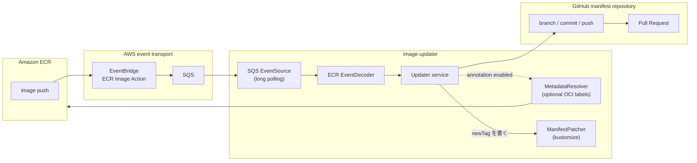

# image-updater

[Argo CD Image Updater](https://github.com/argoproj-labs/argocd-image-updater) と同じく
GitOps manifest のイメージ参照を更新する役割を持ち、コンテナレジストリの image push
イベントを起点に GitHub PR を作る、event-driven（push型）の Git write-back ツール。

## Why

Argo CD Image Updater に近い役割を、registry tag polling ではなく push event を起点として実現する。
もともとは [argocd-image-updater のレジストリタグ解決に関する問題](https://github.com/argoproj-labs/argocd-image-updater/issues/657)
を回避するため、**レジストリが送る push イベントをそのまま更新候補として扱う**方式を選んだ。

- registry tag discovery の定期 poll を待たず、イベントの repository と tag を更新候補にできる
- 「どのイメージが push されたか」をイベントから受け取るため、タグの推測が要らない
- 更新は PR になるため、レビューと revert を通常の Git 操作で行える

## What

1. ECR の push イベントを EventBridge と SQS 経由で受け取る
2. 設定ファイルのルールと突き合わせて、更新対象の manifest ディレクトリをすべて決める
3. label 注釈が有効な場合だけ OCI label を1回読み、PR の説明を組み立てる
4. 同じ manifest リポジトリの変更を1回の clone・commit・push・PR にまとめる
5. PR merge 後の反映は、Argo CD など既存の GitOps controller に委ねる



現在同梱しているイベント経路は ECR・EventBridge・SQS。別レジストリや webhook は
`EventSource` / `EventDecoder` portを実装して追加する拡張点であり、現行 runtime には含まれない。

## Installation

> [!NOTE]
> **TODO:** Helm Chartによるdeploymentに対応する。Chartとinstallation手順は別PRで追加予定。

設定方法: [日本語](./docs/ja/configuration.md) / [English](./docs/en/configuration.md)

## Contribution

Issue、機能提案、ドキュメント改善、Pull Requestを歓迎します。
変更を送る前に、次のcommandが成功することを確認してください。

```bash
go build ./...
go test ./...
golangci-lint run ./...
```
