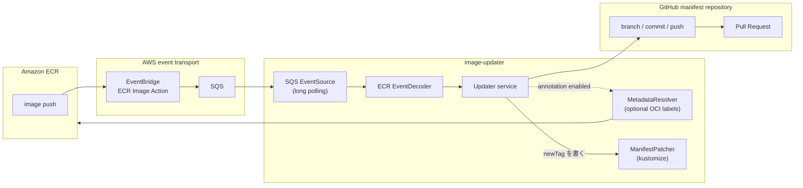

# image-updater

[Argo CD Image Updater](https://github.com/argoproj-labs/argocd-image-updater) と同じく
GitOps manifest のイメージ参照を更新する役割を持ち、コンテナレジストリの image push
イベントを起点に GitHub PR を作る、event-driven（push型）の Git write-back ツール。

## What

1. ECR の push イベントを EventBridge と SQS 経由で受け取る
2. 設定ファイルのルールと突き合わせて、更新対象の manifest ディレクトリをすべて決める
3. label 注釈が有効な場合だけ OCI label を1回読み、PR の説明を組み立てる
4. 同じ manifest リポジトリの変更を1回の clone・commit・push・PR にまとめる
5. PR merge 後の反映は、Argo CD など既存の GitOps controller に委ねる



現在同梱しているイベント経路は ECR・EventBridge・SQS。別レジストリや webhook は
`EventSource` / `EventDecoder` portを実装して追加する拡張点であり、現行 runtime には含まれない。

## Installation

### Artifact versions

Application/containerとHelm Chartは独立してversioningする。

| Artifact | Git tag | Published artifact |
| --- | --- | --- |
| Application | `vX.Y.Z` | `ghcr.io/murasame29/image-updater:X.Y.Z` |
| Helm Chart | `chart-vA.B.C` | `oci://ghcr.io/murasame29/charts/image-updater:A.B.C` |

`master`のapplication buildは`edge`と`sha-<full commit SHA>`をpublishする。stableな`vX.Y.Z`は
`X.Y.Z`・`X.Y`・`latest`を更新し、majorが1以上の場合だけ`X`も更新する。prereleaseは
`X.Y.Z-rc.N`だけをpublishし、floating tagを更新しない。Applicationのexact SemVerとChart versionは
release workflowだけがpublishし、同じreleaseの再実行で検証済みartifactが見つかった場合だけ採用する。
異なるcommitまたはarchiveの既存artifactはfailし、上書きしない。厳密な再現性が必要なproduction deploymentでは
exact SemVerまたは`image.digest`を使用する。

Containerのbuild identityは環境設定なしで確認できる。

```bash
docker run --rm ghcr.io/murasame29/image-updater:0.1.0 --version
# image-updater version=0.1.0 commit=<commit SHA> build_date=<source commit timestamp; RFC3339 UTC>
```

### Helm

Chart `0.1.0`はapplication `0.1.0`をdefaultかつ検証済みversionとして使用する。`image.tag`が空なら
`Chart.appVersion`へfallbackし、`image.digest`を指定した場合はtagより優先する。
EKSではlong-lived AWS credentialsをPodへ渡さず、IRSAまたはEKS Pod Identityの利用を推奨する。
GitHub App private keyはHelm valuesへ埋め込まず、既存のKubernetes Secretからmountする。

```bash
kubectl create namespace image-updater

kubectl --namespace image-updater create secret generic image-updater-github \
  --from-file=private-key.pem=/path/to/github-app-private-key.pem

cp example/values.example.yaml values.yaml
# values.yamlのconfig.inline、SQS URI、GitHub App ID、AWS identityを環境に合わせて編集する

helm upgrade --install image-updater \
  oci://ghcr.io/murasame29/charts/image-updater \
  --version 0.1.0 \
  --namespace image-updater \
  --values values.yaml
```

release前のsource treeから検証する場合はOCI URLの代わりに`./charts/image-updater`を指定する。
private GHCR packageを利用する場合は事前に`helm registry login ghcr.io`を行い、Podには
`imagePullSecrets`を設定する。

Chartは`config.inline`からconfig.yamlを生成する方法と、`config.existingConfigMap`で既存ConfigMapを
参照する方法をサポートする。GitHub App private keyは`github.secretKeyRef.name/key`で参照する。
外部管理のConfigMapまたはSecretを更新した場合は、起動時に再読込されるようDeploymentをrestartする。

設定方法: [日本語](./docs/ja/configuration.md) / [English](./docs/en/configuration.md)
Helm values: [`charts/image-updater/values.yaml`](./charts/image-updater/values.yaml)

## Release

`0.x`では新機能または破壊的変更でminor、後方互換な修正でpatchを上げる。`1.0.0`以降は
通常のSemVer（breaking=major、feature=minor、fix=patch）を適用する。Applicationのpublic contractは
config.yaml・環境変数・queue event、Chartのpublic contractはvalues・resource naming・upgrade behaviorとする。

初回releaseはapplicationを先にpublishし、そのimageを確認してからChartをpublishする。

```bash
# masterのchecks成功後
git tag -a v0.1.0 -m 'release application v0.1.0'
git push origin v0.1.0

# container release成功後
git tag -a chart-v0.1.0 -m 'release Helm chart v0.1.0'
git push origin chart-v0.1.0
```

`vX.Y.Z`はmulti-architecture imageとGitHub Releaseを作成する。`chart-vA.B.C`はtag suffixと
`Chart.yaml.version`の一致、および`appVersion` imageの存在を検証してからOCI ChartとGitHub Releaseを
作成する。Applicationはcommit/version labelが一致するexact image、Chartはdraft Release assetとbyte一致する
OCI packageに限り、同じtagの再実行時に採用してfinalizeする。それ以外の既存versionはfailし、artifactを
置換しない。GHCRのpackage write権限はこれらのworkflowだけに限定し、外部publisherとのcheck-and-push raceを
防ぐ。Repositoryで[immutable releases](https://docs.github.com/en/code-security/concepts/supply-chain-security/immutable-releases)を
利用できる場合は有効化し、公開後のGit tagとRelease assetも保護する。
ApplicationとChartのversionは一致を必須とせず、`appVersion`がそのChartでdefaultかつ検証済みのApplication
versionを示す。

## License

image-updater本体は[Apache License 2.0](./LICENSE)で公開しています。project固有のnoticeは
[`NOTICE`](./NOTICE)を参照してください。各third-party componentには、それぞれのlicenseが引き続き
適用されます。

公開container imageは、実際にbuildされたGo package graphのcomponent一覧とlicense全文を
`/licenses`へ格納します。runtime baseのcopyright情報は`/usr/share/doc`に保持されます。
Helm Chart archiveはrepository rootから独立して再配布できるよう、Chart自身の`LICENSE`と`NOTICE`を同梱します。

## Contribution

Issue、機能提案、ドキュメント改善、Pull Requestを歓迎します。
変更を送る前に、次のcommandが成功することを確認してください。

```bash
go build ./...
go test -race ./...
golangci-lint run ./...
bash hack/check_licenses.sh

docker buildx build --platform linux/amd64,linux/arm64 .

helm lint charts/image-updater --strict --values charts/image-updater/ci/test-values.yaml
helm template image-updater charts/image-updater \
  --namespace image-updater \
  --values charts/image-updater/ci/test-values.yaml
helm lint charts/image-updater --strict --values example/values.example.yaml
helm package charts/image-updater --destination "${TMPDIR:-/tmp}"

docker run --rm -v "$PWD:/repo" -w /repo rhysd/actionlint:1.7.12 -color
```

release workflowの詳細なpositive/negative contractは`.github/workflows/docker-build.yml`、
`.github/workflows/helm.yml`、`.github/workflows/chart-release.yml`を参照してください。
